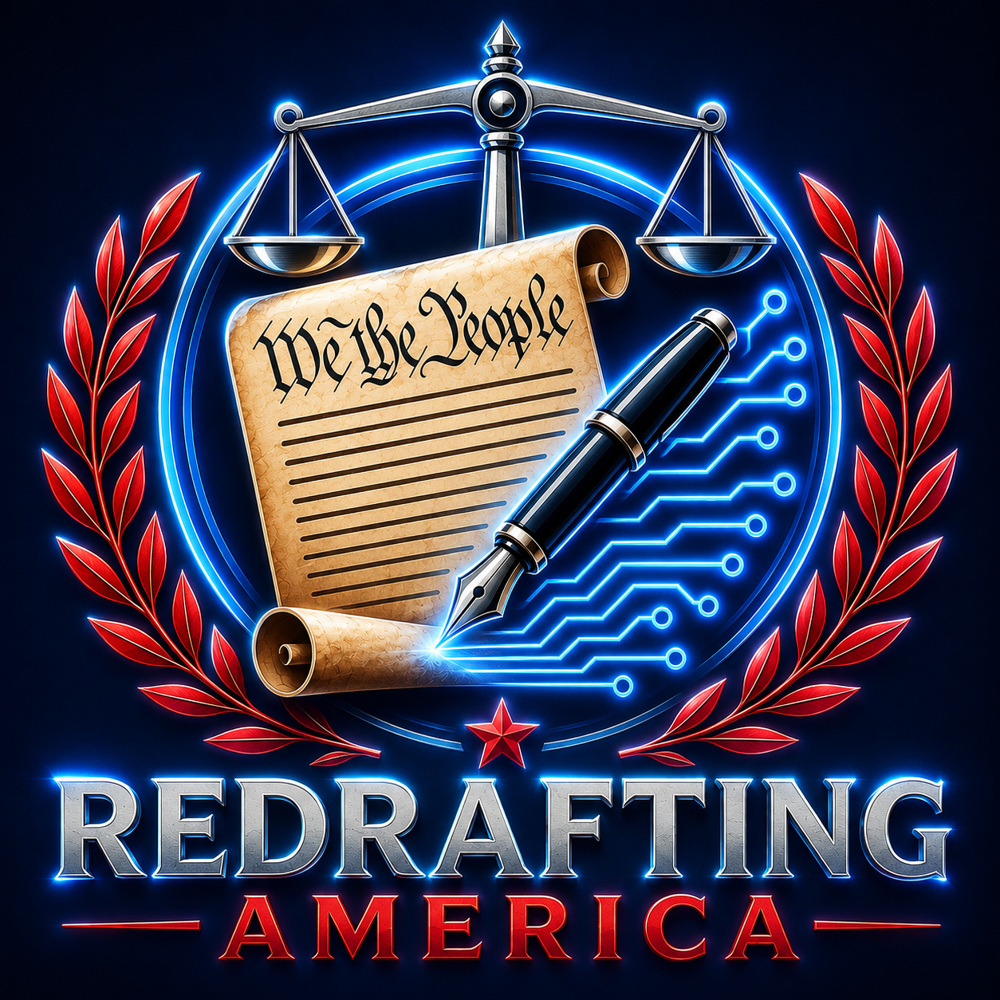

  

  <em>Veritas Super Omnia — The Truth Above All Else</em>

  
  

---

## What this is

Redrafting America is a nonprofit civic initiative designing **Constitution v2.0** — a modern constitutional framework for a future democratic society, built around truth, accountability, and human dignity.

🔗 **[redraftingamerica.org](https://redraftingamerica.org)** — public site

## What we're building

- **Constitution v2.0** — the flagship framework, drafted Article by Article, with a companion Lexicon defining each constitutional institution (the Concordium, the Aequitium, the Veritium, and others) and a series of White Papers explaining the reasoning behind key provisions.
- **Nonprofit formation** — Bylaws and Articles of Incorporation, ahead of our 501(c)(3) filing in Philadelphia, PA.
- **Public infrastructure** — the website, phone system, and civic tooling behind the organization.

## Repositories

| Repo | Purpose | Access |
|---|---|---|
| [`redrafting-america`](https://github.com/redrafting-america/redrafting-america) | Public website at redraftingamerica.org | Public (Beta) |
| [`.github`](https://github.com/redrafting-america/.github) | Organization profile and community health files | Public |
| `bylaws` | Bylaws & Articles of Incorporation | Private |
| `constitution2` | Constitution v2.0 — manuscript, research, exports | Private |
| `phone` | Phone system, call routing, and voice prompts | Private |
| `blog` | Drafting Room editorial workspace | Private |
| `infrastructure` | Infrastructure configuration and documentation | Private |
| `scripts` | Internal automation and maintenance scripts | Private |
| `logs` | Internal operational logs | Private |

Repos are currently private while the organization is still forming and drafting. Some will open up as the project moves through its roadmap.

## Get in touch

- 📞 [(215) 488-6742](tel:+12154886742)
- ✉️ [github@redraftingamerica.org](mailto:todd.mcguckin@redraftingamerica.org)
- 📍 Philadelphia, PA — the birth of our nation

---

<em>The Future Is Ours To Rewrite.</em>

